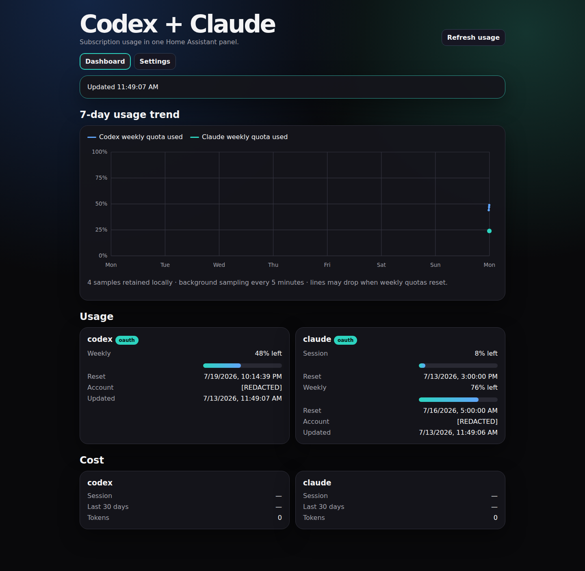
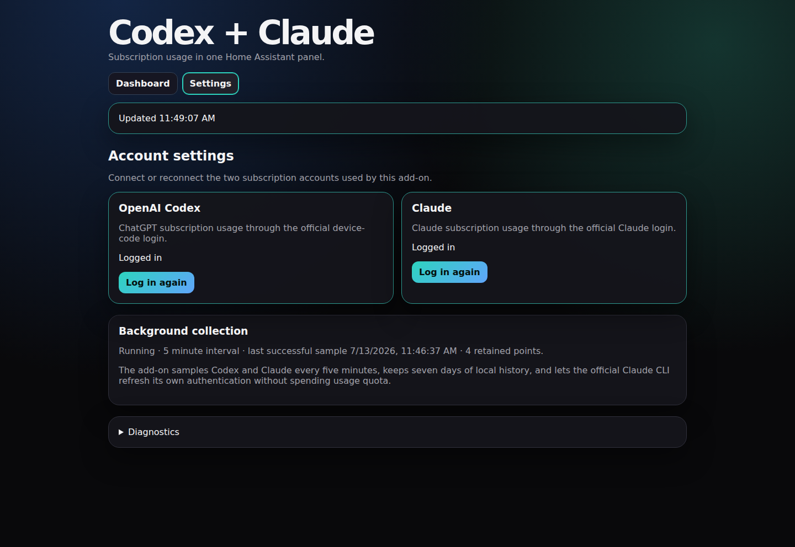

# Codex + Claude usage for Home Assistant

A focused Home Assistant Ingress add-on that shows OpenAI Codex and Claude subscription usage together using CodexBar.

It maintains one persistent combined seven-day usage graph. Samples are collected every five minutes in the background, so the Home Assistant panel does not need to remain open.

## Screenshots

Account identifiers are redacted; the dashboard is otherwise captured from the running Home Assistant add-on.

Login happens entirely from the sidebar panel:

- Codex displays the official browser URL and one-time device code.
- Claude displays the official authorization URL and accepts the returned code when required.
- Credentials persist inside add-on storage across restarts.

No desktop launch inside the container, file upload, API-key provider setup, or manually edited JSON is required.

Supported architectures: `amd64` and `aarch64`.
